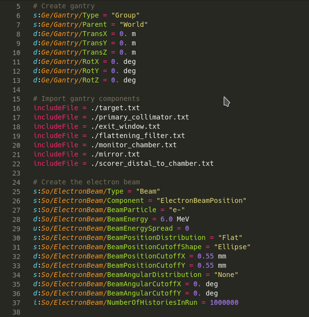

# Topas Syntax Highlighting

A [Visual Studio Code](https://code.visualstudio.com/) extension to add syntax highlighting to [Topas](www.topasmc.org) monte carlo parameter files.

The language grammar has been converted from [David C. Hall's](https://github.com/davidchall) [Sublime Text extension](https://github.com/davidchall/topas-syntax).

This extension was developed to help the Topas community, and is not officially endorsed by the Topas development team.

The source code for this extension can be viewed [here](https://github.com/samuelpeet/topas-vscode).

## Features

* Syntax highlighting for comments, keywords, datatypes, parameters, booleans, strings, numerics, and operators.

* Integration with VS Code's commenting shortcuts, bracket auto-closing, and selection surrounding.

## Usage

You may need to manually select the language for each project, as Topas parameter files use the ubiquitous .txt extension.

## Release Notes

### 1.0.0

Initial release of extension, including syntax highlighting and vscode integration.

